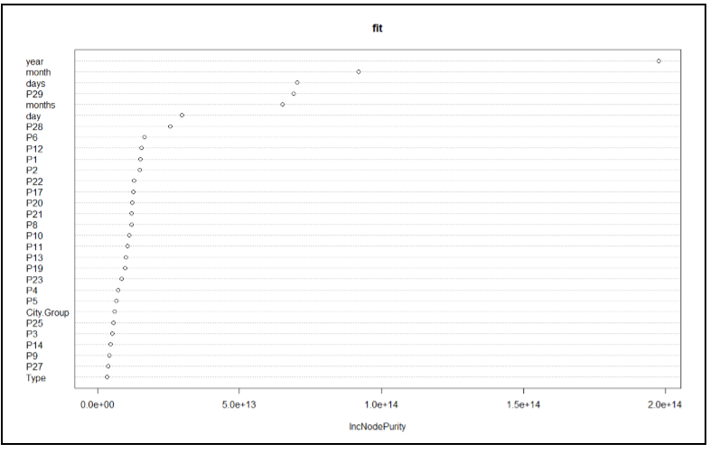
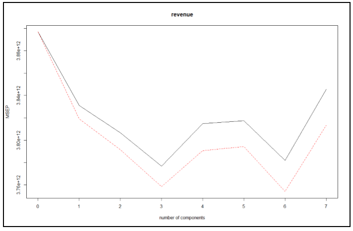
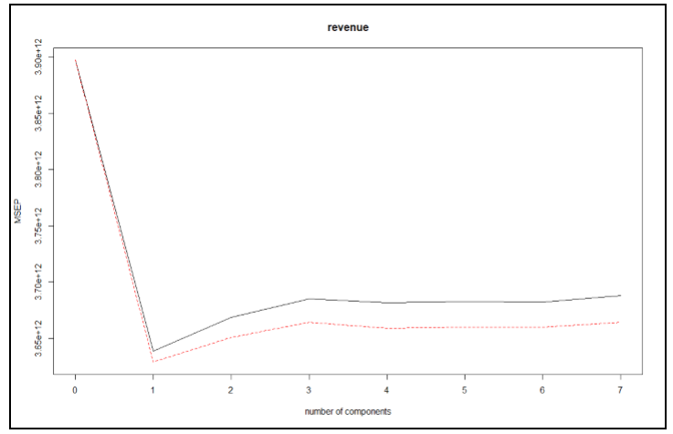
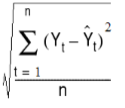

# Introduction-to-Data-Science

The intent of the project, Restaurant Revenue Recognition, is to predict revenue generated by restaurants. The data set is analyzed by using different machine learning techniques: logistic regression, gradient boosting machine, partial least square, forward selection, linear regression, and support vector machine etc. The project explores data previously published at Kaggle. There were some inherent problems with the data set published at Kaggle, which the team discuss in the report and offer viable solutions. 
The final project aims to tackle the difficult situation faced by people who are investing in new restaurant projects. The chief objective of this prediction exercise is to analyze and evaluate various parameters mentioned in the database, and yield results related to success of investments for diverse parameters. The target audience are the people willing to make new investments in the restaurant business. The different machine learning algorithms used by the team would ensure that the investors make a calculated decision of their investment and hence maximize their profits. 

Large investments of time and capital are required to run a restaurant business. If the business fails for some reason, the investing party incurs heavy loss. Our project considers and examines various parameters from the given data sets. The outcome of the analysis will display improved investments on the restaurant business. The objective is to assist people wanting to make investments in the restaurant business. 

Data Set:

• ID: Restaurant ID
• Open Date: Date that the restaurant opened in the format M/D/Y 
• City: The city name that the restaurant resides in 
• City Group: The type of city can be either big cities or other 
• Type: The type of the restaurant where FC - Food Court, IL - Inline, DT - Drive through and MB – Mobile 
• P-Variables (P1, P2, ......, P37): These are the P-variables and are a measure of the following data -  
➢ Demographic Data: Population, age, gender distribution and development scale. 
➢ Real Estate Data: M2 of the location, front façade, car parking etc. 
➢ Commercial Data: Schools, banks, etc. 
• Revenue: The Revenue Column indicates annual (transformed) revenue and is the primary target of predictive analysis. 

Data Preparation 

Formatted Open-Date: We have converted the Open-Date variable into three different columns, namely – date, month, and year, using ‘dplayer’ library. Later we created two more columns namely – days and months, that stores the count of number of days as well as months ever since the restaurant has started.

Data Filtration: In the given data set, the Id, Open.Date, Date, City are set to null as they have no effect on revenue prediction. The ‘Type’ column has four sub-categories named: FC, DT, IL, and MB. Where MB is missing in the training data set. Thus, to overcome this drawback we convert these sub-categories into equivalent numeric factor. We have 38 unique cities in training data set, whereas 54 unique cities in testing data set and this creates inconsistency in prediction model, so we drop the ‘City’ column from our data set.  
Restaurants having revenues greater than 16,000,000 are not considered in our prediction model as they are the outliers. 
 
Data Modeling:

RANDOM FOREST: A random forest is an ensemble of decision trees created using random variable selection and bootstrap aggregating. At each node of the tree, the split is created according to the random subset of the variables. We applied this algorithm on the training data set, setting the ntree parameter to 1000 with respect to revenue. 

LOGISTIC REGRESSION: Logistic Regression is a predictive analysis used to describe the data and to explain the relationship between one dependent binary variable and one/more nominal, ordinal, interval, or ratio-level independent variables. In our data set we used this algorithm to predict revenues with respect to the effective parameters: City.Group, Open.Date, Type, P8, P26, P28, Open.Year. 

LASSO REGRESSION: Lasso Regression is an absolute shrinkage and selection method used for analyzing the performance for both variable selection and regularization to enhance the prediction accuracy and interpretability of the statistical model it generates. To train our data for Lasso Regression, we create a matrix for the training data set considering just the ‘effective predictive variables’. Further, we predict the revenue of restaurants considering the best lambda value while training our data set for Lasso Regression. 

RIDGE REGRESSION: Ridge Regression is a technique for analyzing multiple regression data that suffer from multicollinearity. When it occurs, least squares estimates are unbiased, but their variances are large thus they are far from the true values. The predictor variables we have used in this regression are highly co-related. The regression is performed considering same training matrix that we used in Lasso. A new best lambda value is generated for Ridge. The revenue is now predicted on based on the newest lambda value. 

PRINCIPAL COMPONENT REGRESSION: This is regression analysis technique based on principal component analysis that considers regressing the outcome on a set of predictors based on its standard linear regression model however uses PCA for estimating unknown regression coefficients. We require ‘pls’ library to perform PCR on our training data set considering just the ‘effective predictive variables’. We used Mean Squared Error Prediction validation technique to predict the revenue of the restaurants. 

PARTIAL LEAST SQUARE: This algorithm is an extension of multiple linear regression model that specifies the relationship between a dependent variable ‘Y’, and set of predictor variables ‘X’ so that  

Y = b0+b1X1+b2X2+…..+bpXp 

In this equation, b0 is the regression coefficient for the intercept and the bi values are the regression coefficients computed from the data. We again performed PCR on our training data set considering just the ‘effective predictive variables’. We used MSEP validation technique to predict the revenue of the restaurants. 

BACKWARD SELECTION: In backward selection we start with a full model and drop the ones which are superfluous, one at a time. So, we created a null model named nmodel and a full model named fmodel considering all the ‘effective predictive variables’. 

STEPWISE SELECTION: In the Stepwise Selection is a method that allows moves in either directions, dropping/adding variables at numerous steps. We used null model with a scope having list of null model as lower and full model as upper and direction as both. 

LINEAR REGRESSION: Linear Regression is a linear approach to modeling the modeling the relationship between a scalar response and one/more explanatory variables. In our analysis we had more than one explanatory variable thus we used multiple linear regression. The multiple explanatory variables used by us are the ‘effective predictive variables’. 

GRADIENT BOOSTING MACHINE: This algorithm produces a prediction model in the form of an ensemble of weak prediction models which typically are decision trees. This model is introduced to handle variety of loss function. Consecutive trees are introduced to solve the net loss of prior trees. The result is now new trees are partially applied to create a prediction model. We performed GBM using ‘gbm’ library with respect to the standard ‘effective predictive variables’.

SUPPORT VECTOR MACHINE:  SVM are supervised learning models with associated learning algorithm that can be used to analyze data for both classification and regression analysis. SVM constructs a hyperplane or set of hyperplanes in a high-dimensional space, which can be used for classification, regression, or outliers detection. The hyperplane having the largest distance to the nearest training data point of any class is a good separation. We train our data set with respect to ‘effective predictive variables’ to predict the revenue all restaurant IDs of the test data set. Library ‘e1071’ is required to run SVM. 

EVALUATION

We calculated the performance of all the predictive models using the root mean squared error of the test data set revenue.

RMSE =  

Where ‘Yt’ is the predicted revenue of the ith restaurant and ‘Ŷt’ is the actual revenue of the ith restaurant. 

COMPUTATIONAL EXPERIMENT & RESULTS

Using RMSE evaluation technique on each predictive model, we have selected the ones with least values for our prediction, however the RMSE of each model is given as: 
➢ Logistic Regression: 1131755 
➢ Lasso Regression: 1111835   
➢ Ridge Regression: 1116012 
➢ Principal Component Regression: 1103852 
➢ Partial Least Square: 1127979 
➢ Backward Selection: 1122023 
➢ Stepwise Selection: 1122023 
➢ Linear Regression: 1131755 
➢ Gradient Boosting Machine: 1103778 
➢ Support Vector Machine: 1260842 
